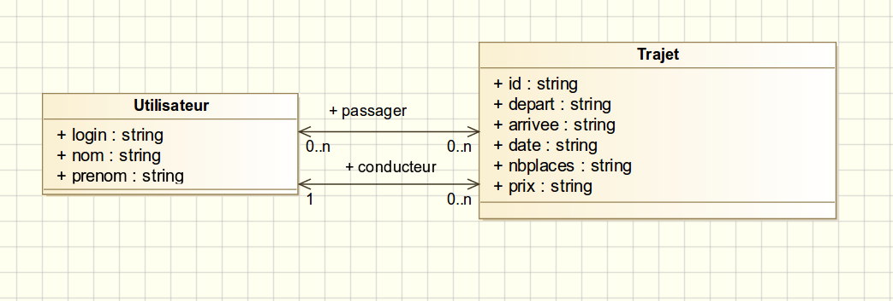

Dans ce TD, nous allons reprendre et finir le TD précédent sur l'enregistrement
des données dans une BDD en utilisant la classe `PDO` de PHP. Nous reprenons à
partir du concept très important de requêtes préparées. Puis nous coderons des
associations entre plusieurs tables de la BDD.

**Attention :** Il est nécessaire d'avoir fini
  [la section 2.1 du TD précédent](tutorial2.html#consulter-la-base-de-donnes),
  qui vous faisait coder votre première requête `SELECT * FROM voiture`, pour
  attaquer ce TD.

## Requêtes préparées

<!--et insertion d'éléments dans la base-->

<!--
Intervention sur les injections SQL avec un exemple simple
-->

Imaginez que nous avons une fonction `getVoiture($immatriculation)` codée comme
suit

~~~
function getVoitureByImmat($immat) {
    $sql = "SELECT * from voiture WHERE immatriculation='$immat'"; 
    $rep = Model::$pdo->query($sql);
    $rep->setFetchMode(PDO::FETCH_CLASS, 'Voiture');
    return $rep->fetch();
}
~~~
{:.php}

Cette fonction marche mais pose un gros problèmes de sécurité ; elle est
vulnérable à ce que l'on appelle les *injections SQL*. 
<!--
Faire une démo d'injection SQL
L'utilisateur pourrait rentrer dans `$immatriculation` quelque chose d'autre
-->
Pour éviter ceci, PDO fonctionne uniquement par des requêtes préparées. Voici
comment elles fonctionnent :

* On met un *tag* `:nom_var` en lieu de la valeur à remplacer
* On doit préparer la requête
* La requête préparée attend alors des valeurs et d'être exécutée
* On peut alors récupérer les résultats comme précédemment

~~~
function getVoitureByImmat($immat) {
  $sql = "SELECT * from voiture WHERE immatriculation=:nom_var";
  // Préparation de la requête
  $req_prep = Model::$pdo->prepare($sql);
  
  $values = array(
     //nomdutag => valeur,
     "nom_var" => $immat,
   );
  // On donne les valeurs et on exécute la requête	 
  $req_prep->execute($values);

  // On récupère les résultats comme précédemment
  $req_prep->setFetchMode(PDO::FETCH_CLASS, 'Voiture');
  return $req_prep->fetch();
  // Attention, si il n'y a pas de résultats, fetch renvoie FALSE
  // Pour voir si il y a des résultat : ($req_prep->rowCount() != 0)
}
~~~
{:.php}

**Remarque :** Il existe une autre solution pour associer une à une les valeurs
aux variables d'une requête préparée avec la fonction
[`bindParam`](http://php.net/manual/fr/pdostatement.bindparam.php) de la classe
PDO. Cependant nous vous conseillons d'utiliser systématiquement la syntaxe avec
un tableau `execute($values)`.

1. Copiez la fonction précédente dans `Voiture.php` et testez-là dans
`lireVoiture.php`.
2. Créez une fonction `save()` dans la classe `Voiture` qui insère la voiture
courante (`$this`) dans la BDD. On vous rappelle la syntaxe SQL d'une insertion :

   ~~~
   INSERT INTO table_name (column1, column2, ...) VALUES (value1, value2, ...)
   ~~~
   {:.sql}

3. Modifier la page  `creerVoiture.php` du TD précédent de sorte qu'elle sauvegarde
l'objet `Voiture` créé.
4. Testez l'insertion grâce au formulaire `formulaireVoiture.html` du TD n°1. 
5. Vérifiez dans PhpMyAdmin que les voitures sont bien sauvegardées.

**N'oubliez-pas** de protéger tout votre code contenant du PDO
  (`getAllVoitures`, ...)  avec des try - catch comme dans `Model`. En effet,
  chaque ligne de code liée à PDO est susceptible de lancer une exception,
  qu'il nous faut capturer et traiter (rôle du `catch`).

## Création des tables de notre site de covoiturage

Reprenons les classes du TD précédent sur le covoiturage pour y ajouter la
gestion de la persistance. Vous avez couvert dans le cours "Analyse, Conception
et Développements d'Applications" les diagrammes de classes. Ce type de
diagramme est utile pour penser la base de donnée d'une application web. Voici
le notre :

**Question :** Comment implémenteriez-vous l'association *conducteur* entre
utilisateurs et trajets dans la BDD en tenant compte de sa multiplicité ?

**Notre solution.** Comme il n'y a qu'un conducteur par trajet, nous allons
  rajouter un champ `conducteur_login` à la table `trajet`.

1. Dans votre PhpMyAdmin, créez une table `utilisateur` avec les champs suivants :
   * `login` : VARCHAR 32, clé primaire
   * `nom` : VARCHAR 32
   * `prenom` : VARCHAR 32

   **Important :** Pour faciliter la suite du TD, mettez à la création de toutes
     vos tables `InnoDB` comme moteur de stockage, et `utf8_general_ci` comme
     interclassement (explications plus loin).

1. Insérez quelques utilisateurs.
2. Créez une table `trajet` avec les champs suivants :
   * `id` : INT, clé primaire, qui s'auto-incrémente (voir en dessous)
   * `depart` : VARCHAR 32
   * `arrivee` : VARCHAR 32
   * `date` : DATE
   * `nbplaces` : INT
   * `prix` : INT
   * `conducteur_login` : VARCHAR 32
   
   **Note :** On souhaite que le champ primaire `id` s'incrémente à chaque nouvelle
   insertion dans la table.  Pour ce faire, sélectionnez pour le champ `id` la
   valeur par défaut `NULL` et cochez la case `A_I` (auto-increment).

   **Important :** Avez-vous bien pensé à `InnoDB` et `utf8_general_ci` comme précédemment ?

2. Insérez quelques trajets en prenant soin de ne pas remplir la case `id` (pour
   que l'auto-incrément marche) et en mettant dans `conducteur_login` des login
   d'utilisateurs valides (pour éviter des problèmes par la suite).

## Premier lien entre `utilisateur` et `trajet`

On souhaite que le champ `trajet.conducteur_login` corresponde à tout moment à un
login de conducteur `utilisateur.login`. Vous souvenez-vous quelle est la
fonctionnalité des bases de données qui permet ceci ?

**Réponse:** Il faut utiliser des clés
  étrangères.

Voici les étapes pour faire ce lien :

1. À l'aide de l'interface de PhpMyAdmin, faites de `trajet.conducteur_login` un
   **index**.

   **Aide:** Dans l'onglet `Structure` de la table `trajet`, cliquez sur l'icône de
   l'action `index` en face du champ `conducteur_login`.

   **Plus de détails:** Dire que le champ `conducteur_login` est un **index** revient à
   dire à MySql que l'on veut trouver rapidement les lignes qui ont un `conducteur_login`
   donné. Du coup, MySql va construire une structure de donnée pour permettre cette
   recherche rapide.  Une **clé étrangère** est nécessairement un **index** car on
   a besoin de ce genre de recherches pour tester rapidement la contrainte de clé
   étrangère.

2. Rajoutez la contrainte de **clé étrangère** entre `trajet.conducteur_login` et
   `utilisateur.login`. Pour ceci, allez dans l'onglet `Structure` de la table
   `trajet` et cliquez sur `Gestion des relations` pour accéder à la
   gestion des clés étrangères.  

   Nous allons utiliser le comportement `ON DELETE CASCADE` pour qu'une association
   soit supprimé si la clé étrangère est supprimée, et le comportement `ON UPDATE
   CASCADE` pour qu'une association soit mise à jour si la clé étrangère est mise à
   jour.

   **Attention :** Pour supporter les clés étrangères, il faut que le moteur de
   stockage de toutes vos tables impliqués soit `InnoDB`. Vous pouvez choisir ce
   paramètre à la création de la table ou le changer après coup dans l'onglet
   `Opérations`.

<!--
Plutôt que le texte: "Reprendre les classes du TP précédent sur le covoiturage et y ajouter l'utilisation d'une base de données. Chaque utilisateur sera identifié par un id, de même pour chaque trajet."

-> Il faudrait donner soit le diagramme de classe, soit mieux entités/associations de trajet (annonce), voiture et utilisateur. 
-->

## Association entre utilisateurs et trajets

### Dans la base de donnée

**Question :** Comment implémenteriez-vous l'association *passager* entre
utilisateurs et trajets dans la BDD en tenant compte de ses multiplicités ?

**Réponse:** Comme la relation *passager* est non
bornée (on ne limite pas le nombre d'utilisateurs d'un trajet et inversement), on
utilise une table de jointure.

Nous choisissons donc de créer une table `passager` qui contiendra deux champs :

* l'identifiant INT `trajet_id` d'un trajet et
* l'identifiant VARCHAR(32) `utilisateur_login` d'un utilisateur.

Pour inscrire un utilisateur à un trajet, il suffit d'écrire la ligne
correspondante dans la table `passager` avec leur `utilisateur_login` et leur
`trajet_id`.

**Question :** Quelle est la clé primaire de la table `passager` ?

**Réponse:** Le couple
  (trajet_id,utilisateur_login). Si vous choisissez trajet_id seul comme clé
  primaire, un trajet aura au plus un passager, et si vous choisissez
  utilisateur_login, chaque utilisateur ne pourra être passager que sur un
  unique trajet.

 
1. Créer la table `passager` en utilisant l'interface de PhpMyAdmin.
L'interclassement général de vos table sera toujours `utf8_general_ci` (c'est
l'encodage des données, et donc des accents, caractères spéciaux ...).

   **Important :** Avez-vous bien pensé à `InnoDB` et `utf8_general_ci` comme précédemment ?

1. Assurez-vous que vous avez bien le bon couple en tant que clé primaire. Cela
   se voit dans `Gestion des relations`.

2. Rajoutez la contrainte de **clé étrangère** entre `passager.trajet_id` et
`trajet.id`, puis entre `passager.utilisateur_login` et
`utilisateur.login`. Utiliser encore les comportements `ON DELETE CASCADE` et
`ON UPDATE CASCADE` pour qu'une association soit mise à jour si la clé étrangère
est mise à jour.

3. À l'aide de l'interface de PhpMyAdmin, insérer quelques associations pour que
la table `passager` ne soit pas vide.

### Au niveau du PHP

#### Liste des utilisateurs d'un trajet et inversement

Nous allons maintenant pouvoir compléter le code PHP de notre site pour gérer
l'association. Commençons par rajouter des fonctions à nos modèles 'Utilisateur'
et 'Trajet'.

Avant toute chose, vous souvenez-vous comment faire une jointure en SQL ? Si
vous n'êtes pas tout à fait au point sur les différents `JOIN` de SQL, vous
pouvez vous rafraîchir la mémoire en lisant
[http://www.w3schools.com/sql/sql_join.asp](http://www.w3schools.com/sql/sql_join.asp).

1. Créer une `public static function findPassagers($id)` dans `Trajet.php` qui
   prendra en entrée un identifiant de trajet. Cette fonction devra retourner un
   tableau d'objets `Utilisateur` correspondant aux utilisateurs inscrits au
   trajet d'identifiant `$id` en faisant la requête adéquate.
   
   <!-- Pourquoi prendre $data et pas $trajet_id en paramètre ? -->
   
   **Indices :**
   
   * Utiliser une requête à base d'`INNER JOIN`. Une bonne stratégie
   pour développer la bonne requête est d'essayer des requêtes dans l'onglet SQL de
   PhpMyAdmin jusqu'à tenir la bonne.
   * Il faut peut-être mettre à jour la classe `Utilisateur` pour qu'elle ait le
   mêmes attributs que la table `utilisateur` de la BDD. Il faut aussi mettre à
   jour le constructeur comme
   [on l'a fait pour `Voiture`](tutorial2.html#majconst).

2. Testons votre fonction. Créez une page `testFindUtil.php` qui
   1. charge les classes nécessaires,
   3. appelle la fonction `findPassagers($id)` avec un identifiant de trajet
      existant,
   4. affiche les utilisateurs renvoyés grâce à la fonction `afficher`.

3. Créez un formulaire `formFindUtil.php` de méthode `GET` avec un champ texte
où l'on rentrera l'identifiant d'un trajet. La page de traitement de ce
formulaire sera `testFindUtil.php`. Modifiez `testFindUtil.php` pour qu'il
récupère l'identifiant envoyé par le formulaire.

1. De la même manière, créer une `public static function findTrajets($login)`
dans `Utilisateur.php` qui prendra en entrée un login d'utilisateur `$login` et
retourne les trajets auxquels il est inscrit en tant que passager.

2.  De la même manière, créez une page de test `testFindTraj.php` et un
formulaire `testFindTraj.php`.

#### Désinscrire un utilisateur d'un trajet et inversement

Rajoutons une dernière fonctionnalité : dans la vue qui liste les trajets d'un
utilisateur, nous voudrions avoir un lien 'Désinscrire' qui enlèverait
l'utilisateur courant du trajet sélectionné.

1. Créer une `public static function deleteUtilisateur($data)` dans `Trajet.php`
qui prendra en entrée un tableau associatif `$data` avec deux champs
`$data['trajet_id']` et `$data['utilisateur_login']`. Cette fonction devra
désinscrire l'utilisateur `utilisateur_login` du trajet `trajet_id`.

2. Créez une page de test `testDelUtil.php` et un formulaire `formDelUtil.php`
   de sorte que l'on puisse rentrer un identifiant de trajet et un login
   d'utilisateur dans le formulaire, et que l'envoi du formulaire redirige sur
   `testDelUtil.php` qui supprimera le passager dans la BDD.

<!--
### Et si le temps le permet

Voici une liste d'idée pour compléter notre site :

1. Notre liste des trajets d'un utilisateur est incomplète : il manque les
   trajets dont il est conducteur (et non passager). La page qui liste les
   trajets d'un utilisateur pourrait donner les deux listes comme conducteur et
   comme passager.
1. Similairement, nous avons oublié le conducteur de la liste des passagers d'un
   trajet. Le rajouter avec un statut à part.
1. Vous pouvez aussi éventuellement mettre en place des `trigger` dans votre SQL
   pour gérer le nombre de passager par véhicule, le fait qu'un passager ne soit
   pas inscrit deux fois à un trajet ...
-->

## Gestion des erreurs

2. Dans un site en production, pour des raisons de sécurité et de confort
d'utilisation, il est déconseillé d'afficher directement un message d'erreur. Pour
cela on va créer une variable pour activer ou désactiver l'affichage des
messages d'erreurs.

   Dans la classe `Conf`, ajouter un attribut  statique `debug` et son getter publique. 

   ~~~
   <?php
     class Conf{
      ...
      
       // la variable debug est un boolean
       static private $debug = True; 
       
       static public function getDebug() {
       	return self::$debug;
       }
   }
   ?>
   ~~~
   {:.php}
   
   Ainsi on peut modifier les messages d'erreurs dans les `catch`.
   
   ~~~
   try {
     ...
   } catch (PDOException $e) {
     if (Conf::getDebug()) {
       echo $e->getMessage(); // affiche un message d'erreur
     } else {
       echo 'Une erreur est survenue <a href=""> retour a la page d\'accueil </a>';
     }
     die();
   }
   ~~~
   {:.php}

