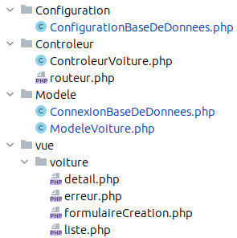

Au fur et à mesure que votre site Web grandit, vous allez rencontrer des
difficultés à organiser votre code. Les prochains TDs visent à vous montrer une
bonne façon de concevoir votre site web. On appelle *architectural pattern*
(patron d'architecture) une série de bonnes pratiques pour l'organisation de
votre site.

Un des plus célèbres *architectural patterns* s'appelle **MVC** (Modèle - Vue -
Contrôleur) : c'est celui que nous allons découvrir dans ce TD.

## Présentation du patron d'architecture **MVC**

Le pattern **MVC** permet de bien organiser son code source. Jusqu'à présent,
nous avons programmé de manière monolithique : nos pages Web mélangent
traitement (PHP), accès aux données (SQL) et présentation (balises HTML). Nous
allons maintenant séparer toutes ces parties pour plus de clarté.

L'objectif de ce TD est donc de réorganiser le code du TD3 pour finalement y
rajouter plus facilement de nouvelles fonctionnalités. Nous allons vous
expliquer le fonctionnement sur l'exemple de la page `lireVoiture.php` du TD2 :

```php
<!DOCTYPE html>
<html>
    <head>
        <meta charset="UTF-8">
        <title>Liste des voitures</title>
    </head>
    <body>
        <?php
        require_once 'Voiture.php';
        $voitures = Voiture::getVoitures();
        foreach ($voitures as $voiture)
          echo $voiture;
        ?>
    </body>
</html>
```

Cette page se basait sur votre classe `Voiture` dans `Voiture.php` :

```php
<?php
require_once "Model.php";

class Voiture {
    private string $marque;
    private string $couleur;
    private string $immatriculation;
    private int $nbSieges;

  public function __construct(string $marque, ...) { ... }

  public function __toString()() { ... }

  public static function getVoitures() { ... }

  public static function getVoitureParImmatriculation(string $immatriculation) { ... }

  public function sauvegarder() { ... }
}
?>
```

L'architecture **MVC** est une manière de découper le code en trois bouts M, V et C
ayant des fonctions bien précises. Dans notre exemple, l'ancien fichier
`lireVoiture.php` va être réparti entre le contrôleur
`Controleur/ControleurVoiture.php`, le modèle `Modele/ModeleVoiture.php` et la vue
`vue/voiture/liste.php`.

Voici un aperçu de tous les fichiers que nous allons créer dans ce TD.



**Conventions de nommage :**
1. Les noms des fichiers PHP de déclaration de classe commencent par une majuscule, les autres non.
2. Les noms des répertoires qui contiennent des déclarations de classe PHP commencent par une majuscule, les autres non.
3. On privilégie le français dans les noms de classe, de fichiers, de fonctions... 

### M : Le modèle

Le modèle est chargé de la gestion des données, notamment des interactions avec
la base de données. C'est, par exemple, la classe `Voiture` que vous avez créé
lors des TDs précédents (sauf la fonction `__toString()`).

<div class="exercise">

1. Créez les répertoires `Configuration`, `Controleur`, `Modele`, `vue` et `vue/voiture`.
2. Utilisez l'outil de refactoring de votre IDE pour renommer : 
   1. la classe `Voiture` en `ModeleVoiture`, 
   2. la classe `Model` en `Modele`,
   3. la classe `Conf` en `Configuration`.  
   
   Vérifiez que les déclarations de type ont bien été mises à jour partout dans votre code.  
   Mettez en commentaire la fonction `__toString()` pour la désactiver.

   **Aide pour le *refactoring*** : Clic droit sur le fichier de déclaration de classe à renommer à PhpStorm, puis *Refactor* → *Rename*.
3. Déplacez vos fichiers `ModeleVoiture.php` et `Model.php` dans le répertoire `Modele/`.
4. Déplacez la classe `Configuration` dans le dossier `Configuration`.
5. Corrigez le chemin relatif du `require_once` du fichier `Configuration.php` dans `Modele.php`.

</div>

**N.B. :** Il est vraiment conseillé de renommer les fichiers et non de les
  copier. Avoir plusieurs copies de vos classes et fichiers est source d'erreur
  difficile à déboguer.

Dans notre cas, la nouvelle classe `ModeleVoiture` gère la persistance au travers
des méthodes :

```php?start_inline=1
 $voiture->sauvegarder();
 ModeleVoiture::getVoitureParImmatriculation($immatriculation);
 ModeleVoiture::getVoitures();
```

**N.B. :** Souvenez-vous que les deux dernières fonctions `getVoitureParImmatriculation`
et `getVoitures` sont `static`. Elles ne dépendent donc que de
leur classe (et non pas des objets instanciés). D'où la syntaxe différente
`NomClasse::nomMethodeStatique()` pour les appeler.

### V : la vue

Dans la vue sont regroupées toutes les lignes de code qui génèrent la page HTML
que l'on va envoyer à l'utilisateur. Les vues sont des fichiers qui ne
contiennent quasiment exclusivement que du code HTML, à l'exception de quelques
`echo` permettant d'afficher les variables préremplies par le contrôleur. Une
boucle `for` est toutefois autorisée pour les vues qui affichent une liste
d'éléments. **La vue n'effectue pas de traitement, de calcul**.

Dans notre exemple, la vue serait le fichier `vue/voiture/liste.php`
suivant. Le code de ce fichier permet d'afficher une page Web contenant toutes
les voitures contenues dans la variable `$voitures`.

```php
<!DOCTYPE html>
<html>
    <head>
        <meta charset="UTF-8">
        <title>Liste des voitures</title>
    </head>
    <body>
        <?php
        foreach ($voitures as $voiture)
            echo '<p> Voiture d\'immatriculation ' . $voiture->getImmatriculation() . '.</p>';
        ?>
    </body>
</html>
```

<div class="exercise">

Créez la vue `vue/voiture/liste.php` avec le code précédent.

</div>

### C : le contrôleur

Le contrôleur gère la logique du code qui prend des décisions. C'est en quelque
sorte l'intermédiaire entre le modèle et la vue : le contrôleur va demander au
modèle les données, les analyser, prendre des décisions et appelle la vue
adéquate en lui donnant le texte à afficher à la vue. Le contrôleur contient
exclusivement du PHP.

Il existe une multitude d'implémentations du **MVC** :

1. un gros contrôleur unique
1. un contrôleur par modèle
1. un contrôleur pour chaque action de chaque modèle

Nous choisissons ici la version intermédiaire et commençons à créer un
contrôleur pour `ModeleVoiture`. Voici le contrôleur
`Controleur/ControleurVoiture.php` sur notre exemple :

```php
<?php
require_once ('../Modele/ModeleVoiture.php'); // chargement du modèle
$voitures = ModeleVoiture::getVoitures();     //appel au modèle pour gerer la BD
require ('../vue/voiture/liste.php');  //redirige vers la vue
?>
```


Notre contrôleur se décompose donc en plusieurs parties :

1. On charge la déclaration de la classe `ModeleVoiture` ;
3. on se sert du modèle pour récupérer le tableau de toutes les voitures avec
`$voitures = Voiture::getVoitures();`
4. on appelle alors la vue qui va nous générer la page Web avec
`require ('../vue/voiture/liste.php');`

**Notes :**

* **Pourquoi `../` ?** Les adresses sont relatives au fichier courant qui est
`Controleur/ControleurVoiture.php` dans notre cas.
* Notez bien que c'est le contrôleur qui initialise la variable `$voitures` et que
la vue ne fait que lire cette variable pour générer la page Web.

<div class="exercise">

1. Créez le contrôleur `Controleur/ControleurVoiture.php` avec le code précédent.
2. Testez votre page en appelant l'URL
[.../Controleur/ControleurVoiture.php](http://webinfo.iutmontp.univ-montp2.fr/~mon_login/PHP/TD4/Controleur/ControleurVoiture.php)
3. Prenez le temps de comprendre le **MVC** sur cet exemple.
   Avez-vous compris l'ordre dans lequel PHP exécute votre code ?
   Est-ce que ce code vous semble similaire à l'ancien fichier
   `lireVoiture.php` ?
   N'hésitez à parler de votre compréhension avec votre chargé de TD.

</div>


### Le routeur : un autre composant du contrôleur

Un contrôleur doit en fait gérer plusieurs pages. Dans notre exemple, il doit
gérer toutes les pages liées au modèle `ModeleVoiture`. Du coup, on regroupe le
code de chaque page Web dans une fonction, et on met le tout dans une classe
contrôleur.

Voici à quoi va ressembler notre contrôleur `ControleurVoiture.php`. On
reconnaît dans la fonction `afficherListe` le code précédent qui affiche toutes les
voitures.

```php
<?php
require_once ('../Modele/ModeleVoiture.php'); // chargement du modèle
class ControleurVoiture {
    // Déclaration de type de retour void : la fonction ne retourne pas de valeur
    public static function afficherListe() : void {
        $voitures = ModeleVoiture::getVoitures(); //appel au modèle pour gerer la BD
        require ('../vue/voiture/liste.php');  //"redirige" vers la vue
    }
}
?>
```


On appelle *action* une fonction du contrôleur ; une action correspond
généralement à une page Web. Dans notre exemple du contrôleur
`ControleurVoiture`, nous allons bientôt rajouter les actions qui correspondent
aux pages suivantes :

1. afficher toutes les voitures : action `afficherListe`
2. afficher les détails d'une voiture : action `afficherDetail`
3. afficher le formulaire de création d'une voiture : action `afficherFormulaireCreation`
3. créer une voiture dans la BDD et afficher un message de confirmation : action `creerDepuisFormulaire`
<!-- 4. supprimer une voiture et afficher un message de confirmation : action `delete` -->

Pour recréer la page précédente, il manque encore un bout de code qui appelle la
méthode `ControleurVoiture::afficherListe()`. Le *routeur* est la partie du contrôleur
qui s'occupe d'appeler l'action du contrôleur. Un routeur simpliste serait le
fichier suivant `Controleur/routeur.php` :

```php
<?php
require_once 'ControleurVoiture.php';
ControleurVoiture::afficherListe(); // Appel de la méthode statique $action de ControleurVoiture
?>
```

<div class="exercise">
1. Modifiez le code de `ControleurVoiture.php` et créez le fichier
   `Controleur/routeur.php` pour correspondre au code ci-dessus ;
2. Testez la nouvelle architecture en appelant la page
[.../Controleur/routeur.php](http://webinfo/~mon_login/PHP/TD4/Controleur/routeur.php).
3. Prenez le temps de comprendre le **MVC** sur cet exemple.
   Avez-vous compris l'ordre dans lequel PHP exécute votre code ?
</div>

#### Maintenant un vrai routeur

Le code précédent marche sauf que le client doit pouvoir choisir quelle action
est-ce qu'il veut effectuer. Du coup, il va faire une requête pour la page
`routeur.php`, mais en envoyant l'information qu'il veut que `action` soit égal à
`afficherListe`. Pour transmettre ces données à la page du routeur, nous allons les
écrire dans l'URL avec la syntaxe du *query string* (cf. [**rappel** sur query
string dans le cours
1]({{site.baseurl}}/classes/class1.html#les-query-strings-dans-lurl)).

De son côté, le routeur doit récupérer l'action envoyée et appeler la méthode
correspondante du contrôleur. Pour appeler la méthode statique de
`ControleurVoiture` dont le nom se trouve dans la variable `$action`, le PHP
peut faire comme suit. Voici le fichier `Controleur/routeur.php` mis à jour :

```php
<?php
require_once 'ControleurVoiture.php';
// On recupère l'action passée dans l'URL
$action = ...;
// Appel de la méthode statique $action de ControleurVoiture
ControleurVoiture::$action();
?>
```

<div class="exercise">

1. Modifiez le code `Controleur/routeur.php` pour correspondre au code ci-dessus
   en remplissant vous-même la ligne 4. Si vous ne vous souvenez plus comment
   extraire un paramètre d'une URL,
   [relisez la partie sur le query string dans le cours
   1.]({{site.baseurl}}/classes/class1.html#les-query-strings-dans-lurl)
1. Testez la nouvelle architecture en appelant la page
   [.../Controleur/routeur.php](http://webinfo/~mon_login/PHP/TD4/Controleur/routeur.php)
   en rajoutant l'information que `action` est égal à `afficherListe` dans l'URL au
   format *query string*.
3. Prenez le temps de comprendre le **MVC** sur cet exemple.
   Avez-vous compris l'ordre dans lequel PHP exécute votre code ?
   Est-ce que ce code vous semble similaire à l'ancien fichier
   `lireVoiture.php` ?
   N'hésitez à parler de votre compréhension avec votre chargé de TD.

</div>

#### Solutions

Voici le déroulé de l'exécution du routeur pour l'action `afficherListe` :

1. Le client demande l'URL
[.../Controleur/routeur.php?action=afficherListe](http://webinfo/~mon_login/PHP/TD4/Controleur/routeur.php?action=afficherListe).
1. Le routeur récupère l'action donnée par l'utilisateur dans l'URL avec
   `$action = $_GET['action'];` (donc `$action="afficherListe"`)
2. le routeur appelle la méthode statique `afficherListe` de `ControleurVoiture.php`
3. `ControleurVoiture.php` se sert du modèle pour récupérer le tableau de toutes les voitures ;
4. `ControleurVoiture.php` appelle alors la vue qui va nous générer la page Web.


## À vous de jouer

### Vue "détail d'une voiture"

Comme la page qui liste toutes les voitures (action `afficherListe`) ne donne pas
toutes les informations, nous souhaitons créer une page de détail dont le rôle
sera d'afficher toutes les informations de la voiture. Cette action aura besoin
de connaître l'immatriculation de la voiture visée ; on utilisera encore le
*query string* pour passer l'information dans l'URL en même temps que l'action :
[.../routeur.php?action=afficherDetail&immatriculation=AAA111BB](http://webinfo/~mon_login/PHP/TD4/Controleur/routeur.php?action=afficherDetail&immatriculation=AAA11BB)

<div class="exercise">

1. Créez une vue `./vue/voiture/detail.php` qui doit afficher tous les
   détails de la voiture stockée dans `$voiture` de la même manière que l'ancienne
   fonction `__toString()` (encore commentée dans `ModeleVoiture`).
   **Note :** La variable `$voiture` sera initialisée dans le contrôleur plus tard,
   *cf.* `$voitures` dans l'exemple précédent.

1. Rajoutez une action `afficherDetail` au contrôleur `ControleurVoiture.php`. Cette
   action devra récupérer l'immatriculation donnée dans l'URL, appeler la
   fonction `getVoitureParImmatriculation()` du modèle, mettre la voiture visée dans la
   variable `$voiture` et appeler la vue précédente.

2. Testez cette vue en appelant la page du routeur avec les bons paramètres dans
l'URL.

3. Rajoutez des liens cliquables `<a>` sur les immatriculations de la vue `liste.php`
   qui renvoient sur la vue de détail de la voiture concernée.

4. On souhaite gérer les immatriculations non reconnues : Créez une vue
   `./vue/voiture/erreur.php` qui affiche un message d'erreur et renvoyez vers
   cette vue si `getVoitureParImmatriculation()` ne trouve pas de voiture qui correspond à
   cette immatriculation.

</div>

### Changement de l'appel à la vue

Actuellement, le chargement d'une vue se fait à l'aide du code 
```php?start_inline=1
require ('../vue/voiture/liste.php');
```
On peut légitimement se demander comment le script `liste.php` accède à la variable locale `$voitures` de
`ControleurVoiture::afficherListe()`. C'est parce que `require` a pour effet
de "copier/coller" les instructions du `liste.php` dans la méthode `ControleurVoiture::afficherListe()`.

Cela pose plusieurs problèmes :
1. la vue a accès à toutes les variables accessibles dans `ControleurVoiture::afficherListe()`,
1. la manière de procéder du `require` est très éloignée d'un code orienté-objet propre.

<div class="exercise">

1. Créez dans `ControleurVoiture.php` une méthode 
   ```php?start_inline=1
   private static function afficherVue(string $cheminVue, array $parametres = []) : void {
      extract($parametres); // Crée des variables à partir du tableau $parametres
      require "../vue/$cheminVue"; // Charge la vue
   }
   ```
   dont le rôle est d'afficher la vue qui se trouve au chemin `$cheminVue`. L'argument `$parametres`
   sert à définir quelles variables existeront lors de l'exécution de la vue. Par exemple, si
   vous appelez
   ```php?start_inline=1
   ControleurVoiture::afficherVue('voiture/detail.php', [
      "voitureEnParametre" => new Voiture("Fiat", "Bleu", "AB123CD", 5)
   ]);
   ```
   alors `afficherVue` affichera la vue `vue/voiture/detail.php`, qui aura accès uniquement à la variable
   `$voitureEnParametre` qui vaut `new Voiture("Fiat", "Bleu", "AB123CD", 5)`. 
   
   Remarques :

   * La création des variables est faite par la fonction 
   [`extract`](https://www.php.net/manual/fr/function.extract.php) fournie par PHP.

   * La syntaxe `$parametres = []` dans la déclaration de `afficherVue` indique que l'argument
   `$parametres` est optionnel. S'il n'est pas fourni, alors il prendra la valeur par défaut
   `[]`.  
    Ainsi, on peut appeler `ControleurVoiture::afficherVue('voiture/detail.php')`, ce qui est un 
    raccourci pour `ControleurVoiture::afficherVue('voiture/detail.php', [])`.

1. Remplacez tous les `require ('../vue/voiture/xxx.php');` par des appels à `afficherVue()`.
   Testez que tout fonctionne.

</div>


### Vue "ajout d'une voiture"

Nous allons créer deux actions `afficherFormulaireCreation` et `creerDepuisFormulaire` qui doivent respectivement
afficher un formulaire de création d'une voiture et effectuer l'enregistrement
dans la BDD.

<div class="exercise">

1. Commençons par l'action `afficherFormulaireCreation` qui affichera le formulaire :
   1. Créez la vue `./vue/voiture/formulaireCreation.php` qui reprend le code de
      `formulaireVoiture.html` fait dans le TD1.
      La page de traitement de ce formulaire devra être l'action `creerDepuisFormulaire` du
      routeur `routeur.php`.
   1. Rajoutez une action `afficherFormulaireCreation` à `ControleurVoiture.php` qui affiche cette
      vue.
1. Testez votre page en appelant l'action `afficherFormulaireCreation` de `routeur.php`.

1. Créez l'action `creerDepuisFormulaire` dans le contrôleur qui devra

   1. récupérer les donnés de la voiture à partir de la *query string*,
   1. créer une instance de `ModeleVoiture` avec les données reçues,
   2. appeler la méthode `sauvegarder` du modèle,
   3. appeler la fonction `afficherListe()` pour afficher le tableau de
      toutes les voitures.

1. Testez l'action `creerDepuisFormulaire` de `routeur.php` en donnant
   l'immatriculation, la marque, la couleur et le nombre de sièges dans l'URL.

1. Testez le tout, c.-à-d. que la création de la voiture depuis le formulaire
   (action `afficherFormulaireCreation`) appelle bien l'action `creerDepuisFormulaire` et que la voiture est bien
   créée dans la BDD.

   **Attention à l'envoi de `action=creerDepuisFormulaire` :** Vous souhaitez envoyer
   l'information `action=creerDepuisFormulaire` en plus des informations saisies lors de
   l'envoi du formulaire. La bonne façon de faire est de rajouter un champ caché à votre formulaire :

   ```html?start_inline=1
   <input type='hidden' name='action' value='creerDepuisFormulaire'>
   ```
   
   Si vous ne connaissez pas les `<input type='hidden'>`, allez lire
   [la documentation](https://developer.mozilla.org/fr/docs/Web/HTML/Element/input/hidden).

   <!-- 
   Si vous avez un formulaire en méthode POST et que vous voulez transmettre l'action en méthode GET,
   vous pouvez rajouter l'information dans l'URL avec

      ```html?start_inline=1
      <form method="post" action='routeur.php?action=creerDepuisFormulaire'>
      ```
   -->
</div>
